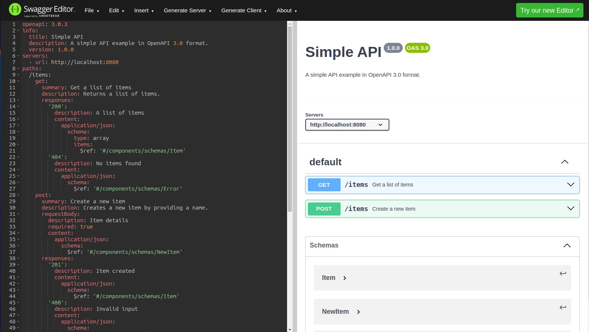

# Пример генерации хендлеров по OpenAPI спецификации

* Генерацию можно выполнить через мэйкфайл по меткам **codegen_fiber** и **codegen_without_fiber**.

**codegen_fiber** Сгенерированный код интегрируется с библиотекой Fiber, т.е. требуется установленный пакет "github.com/gofiber/fiber". Такой подход позволит получить строготипизированные хендлеры, а муршрутизация будет использовать Fiber.

**codegen_without_fiber** Генерация базового серверного кода, без специфики конкретных фреймворков. Файл получается заметно меньше. 

